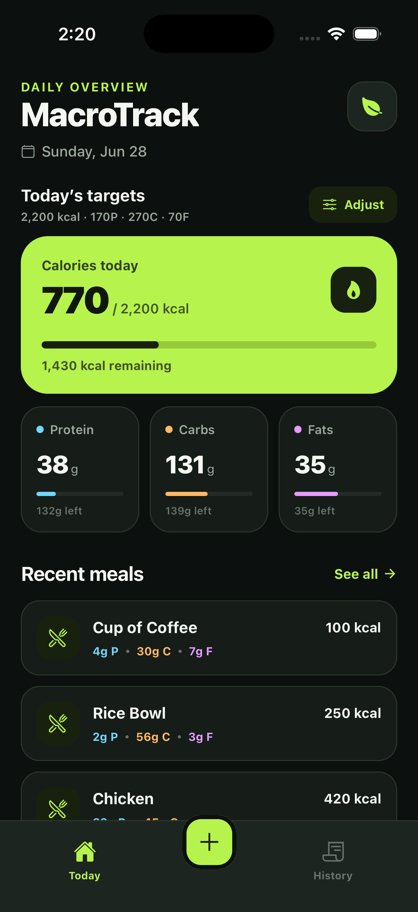
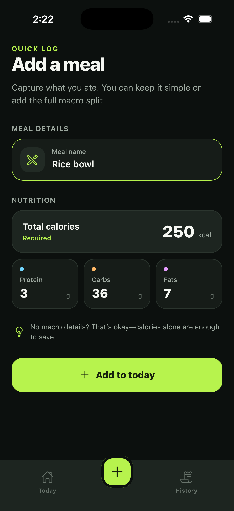
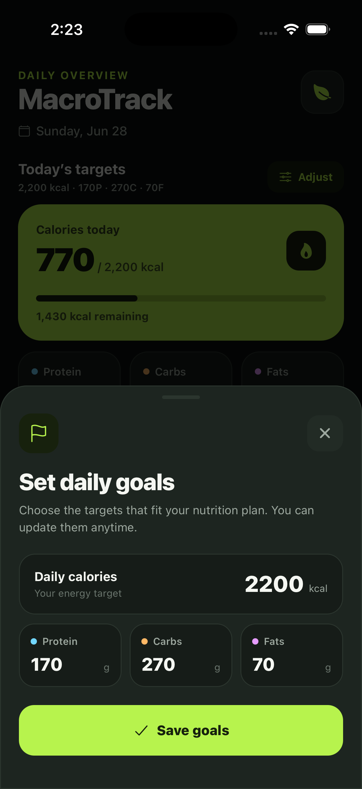
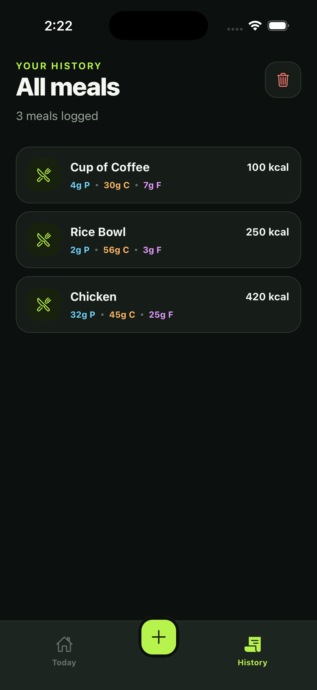

# MacroTrack

<p align="center">
  A focused, beautifully simple macro tracker built with Expo and React Native.
</p>

<p align="center">
  
  
  
  
</p>

MacroTrack helps you log meals, understand your daily nutrition, and stay aligned with personalized calorie and macronutrient targets. It uses a calm dark interface, clear progress indicators, and local-first storage—no account or internet connection required.

Live Links:
[For Android](https://drive.google.com/file/d/1vozERXJD1LXXP3fEcIOVjrLVjBrPH-4-/view?usp=sharing)

> MacroTrack is under active development. The current version focuses on fast, frictionless daily tracking.

## Preview

| Daily dashboard | Add a meal | Set goals | Meal history |
| :---: | :---: | :---: | :---: |
|  |  |  |  |

## Features

### Daily nutrition dashboard

- See calories, protein, carbohydrates, and fats consumed today.
- Track progress against each daily target at a glance.
- View remaining calories and macros through color-coded progress indicators.
- Automatically separates today's totals using the device's local date.

### Custom macro goals

- Adjust calorie, protein, carbohydrate, and fat goals from the dashboard.
- Enter targets in a focused, keyboard-friendly goal editor.
- Prevent invalid or zero-value goals with built-in validation.
- See the dashboard update immediately after saving.


### Fast meal logging

- Add a meal name and calorie count, with optional macro details.
- Use numeric, unit-aware inputs for calories and macronutrients.
- Save calories alone when the full macro breakdown is unavailable.
- Return directly to the updated dashboard after logging.

### Meal history and management

- Review recently logged meals from the home screen.
- Browse the complete meal history in a dedicated view.
- Long-press an individual meal to delete it.
- Clear the complete meal history with a confirmation prompt.

### Local-first experience

- Stores meal history on the device with AsyncStorage.
- Works without creating an account.
- Keeps navigation and data entry fast and distraction-free.
- Supports Android, iOS, and web through Expo.

## Design

MacroTrack uses a dark, nutrition-focused visual system with:

- A high-contrast lime accent for primary actions and calorie progress.
- Dedicated colors for protein, carbohydrates, and fats.
- Large touch targets and visible pressed states.
- Keyboard-aware forms and accessible labels.
- Purposeful empty states and confirmation dialogs.

## Tech stack

| Technology | Purpose |
| --- | --- |
| [Expo SDK 56](https://docs.expo.dev/versions/v56.0.0/) | Cross-platform application tooling |
| [React Native](https://reactnative.dev/) | Native UI development |
| [Expo Router](https://docs.expo.dev/versions/v56.0.0/sdk/router/) | File-based navigation and tabs |
| [TypeScript](https://www.typescriptlang.org/) | Static type safety |
| [AsyncStorage](https://react-native-async-storage.github.io/async-storage/) | On-device meal persistence |
| [Expo Vector Icons](https://docs.expo.dev/guides/icons/) | Interface iconography |

## Getting started

### Prerequisites

- Node.js 22.13 or newer
- npm
- Expo Go on a physical device, or an Android/iOS simulator

### Installation

```bash
git clone https://github.com/Ayush-Pekamwar/MacroTrack
cd macro-track
npm install
```

Start the Expo development server:

```bash
npx expo start
```

From the Expo terminal, press:

- `a` to open Android
- `i` to open iOS
- `w` to open the web app

You can also launch a platform directly:

```bash
npm run android
npm run ios
npm run web
```

## Project structure

```text
macro-track/
├── src/
│   ├── app/
│   │   ├── _layout.tsx          # Root navigation and status bar
│   │   └── (tabs)/
│   │       ├── index.tsx        # Daily dashboard
│   │       ├── add-meal.tsx     # Meal entry form
│   │       └── all-meals.tsx    # Complete meal history
│   ├── components/              # Dashboard, meal, and goal UI
│   ├── storage/meals.ts         # AsyncStorage data operations
│   └── styles/global.ts         # Shared colors, spacing, and styles
├── assets/                      # App icons and static assets
├── images/                      # README screenshots
├── app.json                     # Expo app configuration
└── eas.json                     # EAS build profiles
```

## Available scripts

| Command | Description |
| --- | --- |
| `npm start` | Start the Expo development server |
| `npm run android` | Start Expo and open Android |
| `npm run ios` | Start Expo and open iOS |
| `npm run web` | Start the web version |
| `npm run lint` | Run Expo linting after ESLint is configured |


## License

This project includes an [MIT License](LICENSE).
